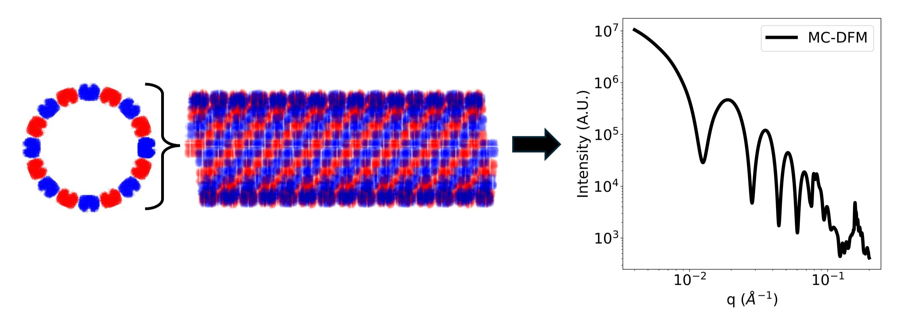

## Description
The Monte Carlo Distribution Function Method is applied to calculate small angle scattering curves of large hierarchical structures. This is useful for many biomolecular assemblies such as protein assemblies or protein crystals. This package includes an efficient and user friendly implementation of the MC-DFM method in python. In addition, the calculation does not require significant computational resources, so it should be able to run on ordinary laptops. We also show examples where the MC-DFM is combined with a genetic algorithm to fit experimental data and obtain structural parameters from it. Examples on calculating the scattering curves of large hierarchical structures are shown in jupyter notebooks in the Notebook folder in this repository. 


<p align="center">
  
</p>

## Method
Instead of calculating the scattering curve directly from the atomic coordinates, the MC-DFM first calculates the pairwise distribution function, which is a histogram of the pairwise distances of the atoms. This is done by randomly sampling the atomic coordinates and calculating the euclidean distance between them. By coding this step entirely with matrix operations, the pairwise distribution function can quickly and efficiently be calculated. 

<p align="center">
  
</p>

At its simplest form, the MC-DFM is similar to the Debye Scattering Equation as both contains a summation of sinc functions. The MC-DFM method substitutes the double summation in the Debye Equation with a single summation over the number of bins in the pairwise histogram. This allows the MC-DFM to be efficiently applied to larger systems. With a large enought sample size, the pairwise distribution function should converge to the true pairwise distribution function, and the scattering curve calculated by the MC-DFM should be equal to the true scattering curve.   

<p align="center">
  
</p>


## Paper 

A preprint describing the methods used in this repository is available online (https://chemrxiv.org/engage/chemrxiv/article-details/679a8c0181d2151a02758fba)
 
## Installation 
To install the package, git clone the repository.


Create and activate a new environment (powershell for windows):

```
python -m venv venv
```
```
cd \venv\Scripts
```
```
.\activate 
```

Go back to the MC-DFM repository and install the package with:

```
pip install . 
```

## Requirements 
This package is written in python. Most of the MC-DFM code is written in Pytorch and can be accelerated with a GPU using the CUDA toolkit. For the full list of libraries used see the require.txt file. The Python version is 3.9 
