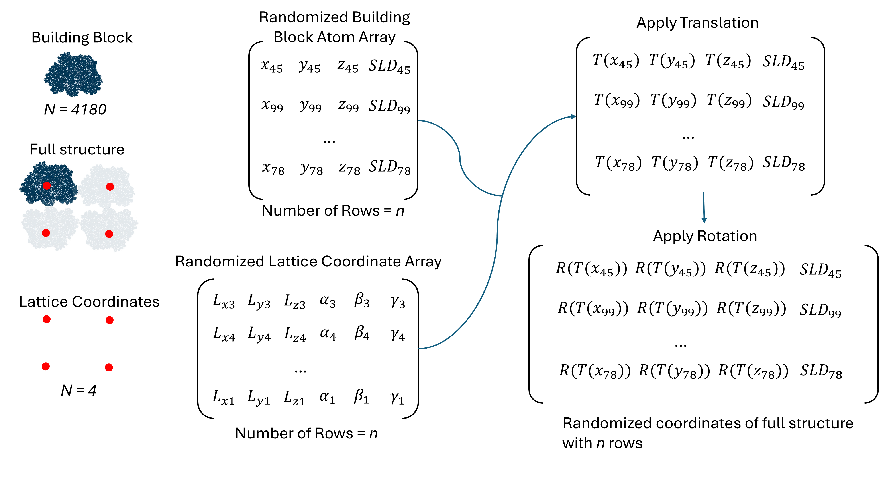

## Description of the code 

  

Scattering Curve of Single Structure
1. Start with the *Atom Array* which contains the $x,y,z$ coordinates of each atom in the scattering object as well as its scattering length density. This array has length $N$, the number of atoms in the scattering object. 
2. Create the *Random Integer Array* which contains random integers that range from 0 to $N$. The length of this array is $n$, a parameter that determines how many pairwise distances to be calculated. 
3. Use *Random Integer Array* to splice *Atom Array*. This results in *Randomized Atom Array 1* which contains the same rows as *Atom Array*, but in a randomized order. In addition, its length is $n$, so the randomized rows can be repeated. 
4. Repeat steps 1-3 to obtain *Randomized Atom Array 2*. 
5. Calculate the pairwise distance between *Randomized Atom Array 1* and *Randomized Atom Array 2* using the distance formula. Use matrix operations for this step for efficiency.  
6. Create the pairwise distribution from the array of distances calculated in the previous step. In Python, this can be done with the *histogram* function from the Numpy package.
7. Convert the pairwise distribution into the scattering intensity using Equation.

  

Scattering Curve of Building Block and Lattice
1. Using steps 1-3 from the section above, create *Randomized Building Block Atom Array* by sampling coordinates from the building block
2. Using steps 1-3 from the section above, create *Randomized Lattice Coordinate Array* by sampling the Lattice Coordinates. The first 3 columns specify the location of each lattice and the last 3 specify the rotation. 
3. Apply the translational transformations to *Randomized Building Block Atom Array*
4. Apply the rotational transformations to *Randomized Building Block Atom Array*
5. Repeat steps 1-4 to obtain another *Randomized Building Block Atom Array*, and calculate the distance between the two arrays. 
6. Create the pairwise distribution and then convert it into the scattering intensity.

